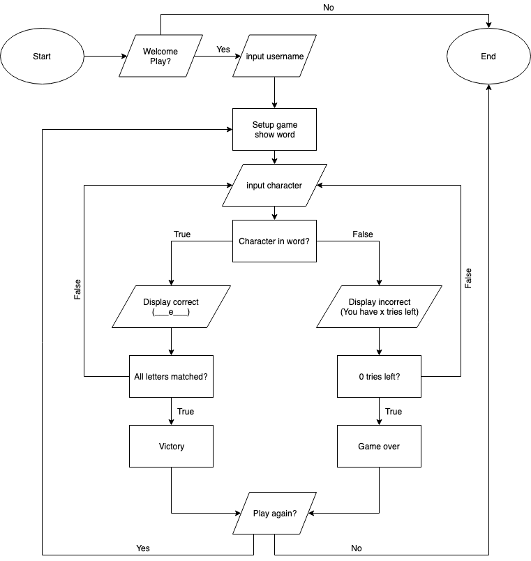

# Ruby installation

[Ruby link  for download](https://linuxize.com/post/how-to-install-ruby-on-ubuntu-18-04/#installing-ruby-from-ubuntu-repositories)

# Github link for Terminal App ?

# Trello Board

Trello(https://trello.com/invite/b/4sAz62hO/86dfc3fd9dc04d00124c4c28d21df4e2/hangman)

# Description  of Hangman game

Hangman is an educational word guessing game to be playled in a command-line interface.The game has been created with Ruby.When the Ruby script is called, it will start a new game and provide the user with a blank word and a clue. The script takes the user input (letter) and checks it against the selected word for the game. Make too many wrong choices and you will lose. Get all the letters correct to win! I use conditionals, string interpolation, classes, arrays and looping to put our Ruby skills to the test.

# Purpose 

The Purpose of making Hangman game just to learning vocabulary and fun way testing the general knowladge. This is done by allowing the user to guess the secret word one letter at a time which can also be helpful for remembering the spelling of new words.

# Functionality

#### Start Program 
#### progmam greet the user.
#### Program randomly generates a question as a clue of the answer.
#### Promts the user the length of the words of that answer just as a clue to guess.
#### Prompts the user for input a letetr
#### check user input ,if correct dispaly letter in Answer word.if incorrect ,display number of live left
#### once game over it will show the message "Game over... better luck next time!"
#### When its win the game it will show "congratulation you have won this round.

# Instruction for use

1. Unzip the ChaiteeDuttaGuhha_T1A3 folder from the zip file.
2. In the command-line and type in bundle install and press Enter to install dependancies.
3. While in the same directory, type "ruby src/Start/console" into the command-line and press Enter to start the program.
4. The user should be greeted by a message
5. The user has a fixed number of guesses
6. The user can choose to play again
7. Letters guessed correctly and incorrectly should be displayed
8. Displays if the user has won or lost
9. Computer picks a random word
10. You will see a number of lines _ _ _ _ _ that represent the  number of letters in the word you have to guess.
11. Guess what the word is by entering one letter at a time.
12. Each correct letter will be revealed in the word.
13. For each incorrect guess, you will lose a life. You only get 7 lives.
14. Once you have finished the game, the program will prompt you for a yes or no if you would like to play again.

# Features

### 1. ARRAY :

Ruby arrays are groupings of almost any entity that are sorted and integer-offset. An
offset is assigned to each element in an array and is used to reference to it.
As in C or Java, array indexing begins at zero. A negative index is assumed relative to
the array's end —- that is, an index of -1 denotes the array's last element, -2
indicates the array's next to last element, and so on.
Ruby arrays can hold objects such as String, Integer, Fix num, Hash, Symbol, even
other Array objects. Ruby arrays are not as rigid as arrays in other languages. Ruby
arrays grow automatically while adding elements to them.

### 2. Methods :

Methods in Ruby are a lot like functions in other programming languages. Ruby
methods are used to group together one or more recurring statements.
The name of the method should start with a lowercase letter. If you start a method
name with an uppercase letter, Ruby may mistake it for a constant and wrongly
process the call.
Methods should be declared before they are called; otherwise, Ruby will throw an
exception for executing an undefined method.

This will produce the following result −

> The programming language is C

>The programming language is C++

>The programming language is Ruby

>The programming language is Perl

The initialize method is a common Ruby class method that functions in a similar fashion to
other object-oriented programming languages' constructors. When you wish to initialize
some class variables at the moment of object creation, the initialize function comes in
handy. This method may take a list of parameters, and it would be prefixed by the def
keyword, just like any other ruby method, as seen below.

### 3. OBJECT-ORIENTED:

Ruby is an object-oriented programming language, which means that everything
appears to Ruby as an object. Even the most basic values in Ruby, such as characters,
integers, and even true and false, are objects. An object that is an instance of the
Class is even a class. This chapter will walk you through all of the key features of
Object-Oriented Ruby.
A class specifies an object's form by combining data representation and methods for
modifying that data into a single package. Members of a class are the data and
methods that make up the class.
When you create a class, you're essentially creating a blueprint for a data type. This
doesn't describe any data, but it does define what the class name signifies, that is,
what a class object will be made up of and what actions can be done on it.
A class definition begins with the keyword class, then the class name, and ends with
a period. For example, using the keyword class, we defined the Box class as follows:

The name must begin with a capital letter, and names that comprise more than one word
are run together with each word capitalised and no separating letters, according to
tradition (CamelCase).
A class serves as the blueprint for things; therefore, an object is essentially formed from
one. The new keyword is used to declare class objects. The following statements declare
two Box objects.

### 4. EXCEPTION:

The execution and the exception are inextricably linked. If you open a file that does
not exist and do not handle the issue correctly, your application is deemed to be of
poor quality.
If an exception occurs, the program will terminate. As a result, exceptions are used
to manage various types of problems that may arise during the execution of a
program and take necessary action rather than stopping the operation entirely.
Ruby has a handy framework for dealing with exceptions. We use rescue clauses to
inform Ruby what sorts of exceptions we want to manage, and we wrap the code
that may cause an exception in a begin/end block.

Syntax: 

Everything is safe, from the beginning to the end. Control is given to the block
between rescue and end if an exception occurs during the execution of this block of
code.
Ruby compares the raised Exception to each of the arguments in turn for each
rescue clause in the begin block. If the exception listed in the rescue clause is the
same type as the presently thrown exception, or is a superclass of that exception,
the match will succeed.
We are permitted to apply an else clause after all the rescue clauses if an exception
does not match any of the error types supplied.

# Core Feature
> Generate a welcome message

> Generate a random word with some clue & rules of the games to user and ask for a letter _ _ _ _ _.

>Game structure in 5 different types of file. i.e. word.rb; display.rb ; random_word.rb , start.rb , word.rb. 

 >Game will start from another file i.e. Start/console.

# Test feature

 Input:
 As per the game give random alphabets according to users choice. For Example: a,b,c...z.

Output:
If the alphabet given matches with the word specified it take you to the next desired word, else will show the man hanging as per wrong input

# Screenshots
## Gems installation

# Flow chart

## Bundler installation
Run Bundler
-----------

Run the command `bundle`, which examines your `Gemfile` to make
sure the correct gems (and, where specified, the correct versions) are
available, and tries to install them otherwise.  This will create a new
file `Gemfile.lock`, *which you should place under version control.*

* What's the difference between the purpose and contents of `Gemfile`
and `Gemfile.lock`?  Which file is needed to completely reproduce the
development environment's gems in the production environment?

> `Gemfile` specifies the gems you need and
> in some cases the constraints on which version(s) are acceptable.
> `Gemfile.lock` records the *actual* versions found, not only of the gems
>  you specified explicitly but also any other gems on which they
>  depend, so it is the file used by the production environment to
>  reproduce the gems available in the development environment.
## Bash installation
