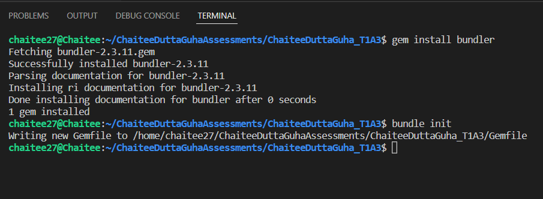

# Ruby installation

[Ruby link  for download](https://linuxize.com/post/how-to-install-ruby-on-ubuntu-18-04/#installing-ruby-from-ubuntu-repositories)

# Github link for Terminal App

# Description  of Hangman game

Hangman is an educational word guessing game to be playled in a command-line interface.The game has been created with Ruby.When the Ruby script is called, it will start a new game and provide the user with a blank word and a clue. The script takes the user input (letter) and checks it against the selected word for the game. Make too many wrong choices and you will lose. Get all the letters correct to win! I use conditionals, string interpolation, classes, arrays and looping to put our Ruby skills to the test.

# Purpose 

The Purpose of making Hangman game just to learning vocabulary and fun way testing the general knowladge. This is done by allowing the user to guess the secret word one letter at a time which can also be helpful for remembering the spelling of new words.

# Functionality

#### Start Program 
#### progmam greet the user.
#### Program randomly generates a question as a clue of the answer.
#### Promts the user the length of the words of that answer just as a clue to guess.
#### Prompts the user for input a letetr
#### check user input ,if correct dispaly letter in Answer word.if incorrect ,display number of live left
#### once game over it will show the message "Game over... better luck next time!"
#### When its win the game it will show "congratulation you have won this round.

# Instruction for use

1. Unzip the ChaiteeDuttaGuhha_T1A3 folder from the zip file.
2. In the command-line and type in bundle install and press Enter to install dependancies.
3. While in the same directory, type ruby src/Start/console into the command-line and press Enter to start the program.
4. The user should be greeted by a message
5. The user has a fixed number of guesses
6. The user can choose to play again
7. Letters guessed correctly and incorrectly should be displayed
8. Displays if the user has won or lost
9. Computer picks a random word
10. You will see a number of lines _ _ _ _ _ that represent the  number of letters in the word you have to guess.
11. Guess what the word is by entering one letter at a time.
12. Each correct letter will be revealed in the word.
13. For each incorrect guess, you will lose a life. You only get 7 lives.
14. Once you have finished the game, the program will prompt you for a yes or no if you would like to play again.

# Test feature

 Input:
 As per the game give random alphabets according to users choice. For Example: a,b,c...z.

Output:
If the alphabet given matches with the word specified it take you to the next desired word, else will show the man hanging as per wrong input

# Screenshots
## Gems installation

## Bundler installation

Run Bundler
-----------

Run the command `bundle`, which examines your `Gemfile` to make
sure the correct gems (and, where specified, the correct versions) are
available, and tries to install them otherwise.  This will create a new
file `Gemfile.lock`, *which you should place under version control.*

* What's the difference between the purpose and contents of `Gemfile`
and `Gemfile.lock`?  Which file is needed to completely reproduce the
development environment's gems in the production environment?

> `Gemfile` specifies the gems you need and
> in some cases the constraints on which version(s) are acceptable.
> `Gemfile.lock` records the *actual* versions found, not only of the gems
>  you specified explicitly but also any other gems on which they
>  depend, so it is the file used by the production environment to
>  reproduce the gems available in the development environment.
## Bash installation

